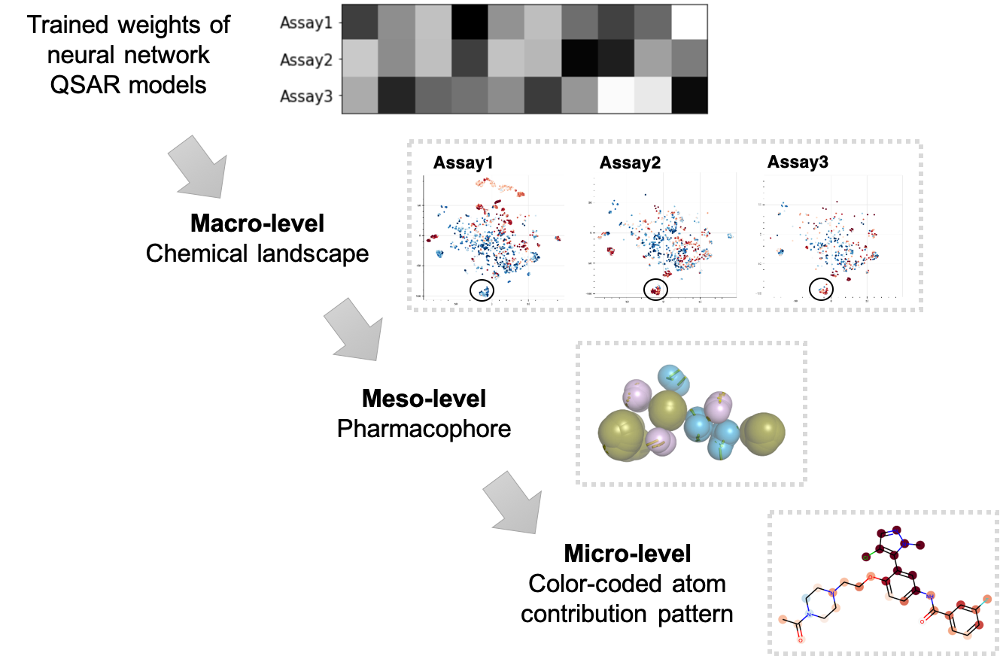

# VISAR

### VISAR: an interactive tool for dissecting chemical features learned by deep neural network QSAR models

Qingyang Ding, Siyu Hou

Bioinformatics Division and Center for Synthetic and Systems Biology, TNLIST/Department of Automation, Tsinghua University, Beijing 100084, China

School of Pharmaceutical Science, Tsinghua University, Beijing 100084,
China.

Please contact dingqy14@mails.tsinghua.edu.cn if you have question or suggestions.

## Table of contents  
* [Aims of this project](#aims-of-this-project)
* [Workflow](#workflow)
* [Usage instructions](#usage-instructions)

## Aims of this project

(Back to [Table of contents](#table-of-contents).)

While many previous works focus on improving predictive merits of the models, few looked into the trained model and check if the model is learning what's truly important, as well as link what have been learned by the model back to useful insights.

Here we take a step forward to interpret the learned chemical features from DNN QSAR models, and present VISAR, an interactive tool for visualizing the structure-activity
relationship (SAR). VISAR firstly provides functions to construct and train DNN models. Then VISAR builds the activity landscapes based on a series of compounds using the trained model, showing the correlation between the chemical feature space and the experimental activity space after model training, and allowing for knowledge mining from a global perspective. VISAR also maps the gradients of the chemical features to the corresponding compounds as contribution weights for each atom, and visualizes the positive and negative contributor substructures suggested by the models from a local perspective. 
Using the web application of VISAR, users could interactively explore the activity landscape and the color-coded atom contributions. 
We propose that VISAR could serve as a helpful tool for training and interactive analysis of the DNN QSAR model, providing insights for drug design, and an additional level of model validation.

The rationale of VISAR workflow is shown in the schematic diagram below:

1) on the macro-level, the activity landscape of training-set compounds regarding specific assays, i.e. the applicability domains, is visualized, within the area of which the
predictions are with a given reliability by the models; 
2) on the meso-level, within each local cluster of compounds on the activity landscape sharing similar features and similar activities, key pharmacophoric features could be identified; 
3) on the micro-level, the color-coded atom contribution of each compound is presented, highlighting atoms which are predicted to be positive (red shading) or negative (blue shading) contributors to the corresponding assay.



The VISAR workflow features:
- For a learning task, VISAR firstly provided users with useful functions to build, train and test the neural network models.
- The learned parameters of the models were then mapped back as contribution weights of each atom and were visualized as structural-activity relationship (SAR) patterns, demonstrating the positive and negative contributor substructure suggested by the trained model.
- VISAR took the transformed features of the chemicals and build activity landscapes, showing the correlation between the descriptor space after model training and the experimental activity space.
- With the interactive web application of VISAR, users could interactively explore the chemical space and the SAR pattern for each chemical.
- Users could provide their compounds of interest, and predict target profiles with the trained model, as well as map them on the chemical space for further analysis.
- The clusters of chemicals on the landscape could be then subject to analysis of active pharmacophores.

We proposed that VISAR could serve as a helpful workflow for training and interactive analysis of the deep neural network QSAR model.

## Workflow

(Back to [Table of contents](#table-of-contents).)


The training, testing and result processing pipeline is available in template jupyter notebooks:

- [Train single task regression model](https://github.com/Svvord/visar/blob/master/Template%20--%20single%20task%20regressor%20training%20and%20analysis.ipynb)
- [Train robust multitask regression model](https://github.com/Svvord/visar/blob/master/Template%20--%20multi-task%20model%20training%20and%20analysis.ipynb)


The general steps for interactive analysis are:
- Set the location (including the prefix) of the pre-composed dataframes and the mode of your training. After clicking "Run" button on the upper panel, the whole interface would update according to your settings.
	- For single task sample dataset, set "Prefix of the input data:" as 'VISAR_webapp/data/T107_rep2_50_' with 'Mode of the model:' as 'ST', and then click "Run";
	- For multitask sample dataset, set 'Prefix of the input data:' as 'VISAR_webapp/data/output_' with 'Mode of the model:' as 'RobustMT', and then click "Run".

- Explore the activity profile of the chemical space on the left panel.
There are several places allowing for interactive exploring, including: A. color options for the scatter plotting, enabling different color rendering based on eg. different activity of the compounds; B. number of bi-clusters, which correlated with the arrangement of the heatmap on the bottom panel (through trying out different bi-cluster numbers, users could gain an idea of how the activity profile is distributed on the chemical landscape); E. information fo the compounds when hovering your mouse on the scatter plot, displaying its ID, batch ID and the color code for the bi-cluster where it belongs; F. information of the batch when hovering your mouse on the heatmap, displaying its ID and color code for the bi-cluster where it belongs.

- Upon selecting the batch or indivisual compounds on the left panel, visualize chemical structures along with the SAR pattern on the right panel. There are two ways for batch selection: first is to directly click on the heatmap, second is to use the drop-down list (C). As for compound selection, use the tap mode of the scatter plot and click on the points. Since for RobustMT mode, multiple tasks give their corresponding SAR patterns for the compound; thus by selecting SAR task (D), the SAR pattern of the compounds would update accordingly.

- If a custom file is provided during the generation of RUNKEY dataframe, the predictive results for custom compounds could then be displayed by clicking the 'custom data' radio button. This function would allow the users to quickly explore the possible key atoms of their compounds of interests, and facilitate the experiment design.


## Usage instructions

(Back to [Table of contents](#table-of-contents).)

1. For model training, a working environment with python=3.6 and CUDA 9.0 is recommended,
and the environment is depended on: Deepchem, Rdkit,
Tensorflow, Numpy, Pandas, Sklearn, Scipy.
The VISAR python package is available for pip install.

```bash
## Create an environment for model training
# either deepchem or pytorch is needed, users could use one of them or both
# option1: deepchem
conda create -n deepchem_visar python=3.6
conda activate deepchem_visar
pip install tensorflow-gpu==1.12.0

# option2: pytorch
conda create -n pytorch_visar python=3.6
conda activate pytorch_visar
pip install pytorch==1.3.0

## Install packages
conda install scipy  # also install six
conda install matplotlib
conda install pandas
conda install seaborn

conda install -c conda-forge scikit-learn  # also install joblib
pip install deepchem==2.1.1.dev353
pip install visar  # also install bokeh

conda install -c rdkit rdkit  # Installs also numpy and pandas

conda install jupyter  # Installs also ipykernel
python -m ipykernel install --user --name deepchem_visar
```

2. For using VISAR web application in visualising the trained models, the requirements
for the environment is fewer, independent of GPU, and could be easily applied
on desktops or laptops of either Windows or macOS platforms with chrome browsers.
To use the interactive application, users need to firstly get the local copy of the
VISAR repository by direct dowloading or

```bash
git lfs install  # enable large file downloading
git lfs clone https://github.com/Svvord/visar.git
```

The installation steps are as follows:
```bash
## Create an environment for visualization using VISAR web application
conda create -n visar_viz python=3.6
conda activate visar_viz

## install packages
conda install -c conda-forge rdkit  # also install numpy and pandas
conda install -c conda-forge scikit-learn   # also install scipy
conda install matplotlib
conda install bokeh
conda install cairosvg

# start the web app
cd /path/of/visar
bokeh serve --show VISAR_webapp
```
